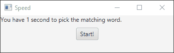

# Speed

Speed is a copy of a game created by Sebastian Lague, originally called Speed Reactions.
He created it using Apple software, however for this project I used JavaFX.

The objective of the game is pressing the button that matches the word displayed
on the top left of the window. The player has 1 second to press the correct
button before the game ends.

# Demo
